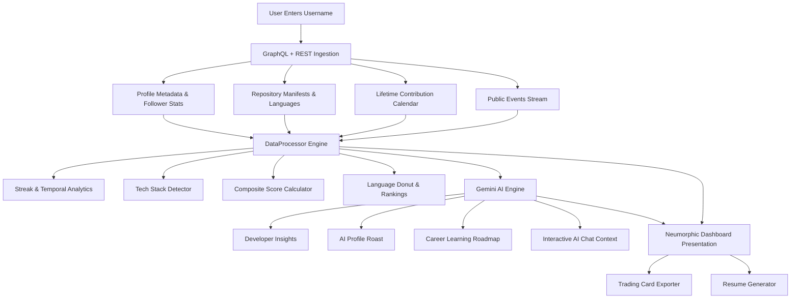

# 🚀 GitHub Profile Activity Analyzer

<p align="center">
  
  
  
  
  
</p>


<p align="center">
  <b>A comprehensive developer intelligence dashboard and portfolio analytics engine.</b><br>
  Analyze coding habits, inspect tech stacks, calculate lifetime contribution heatmaps, generate developer trading cards, export instant resumes, and get actionable AI career insights.
</p>

---

## 📖 Table of Contents

- [Overview](#-overview)
- [Key Features](#-key-features)
- [Project Architecture](#-project-architecture)
- [How It Works](#-how-it-works)
- [GitHub Activity Score Breakdown](#-github-activity-score-breakdown)
- [Quick Start & Setup](#-quick-start--setup)
- [Configuration (`env.js`)](#-configuration-envjs)
- [Technology Stack](#-technology-stack)
- [Security & Privacy](#-security--privacy)
- [Contributing](#-contributing)
- [License](#-license)

---

## 🌟 Overview

**GitHub Profile Activity Analyzer** turns public GitHub activity into actionable developer intelligence. Whether you are reviewing your own coding trajectory, preparing for technical interviews, or auditing open-source contributions, this tool gives you instant visibility into:

- **True Coding Cadence**: Analyzes lifetime contributions via GitHub GraphQL & REST events.
- **Tech Stack Extraction**: Inspects manifest files (`package.json`, `requirements.txt`, `go.mod`, `pom.xml`, etc.) to uncover real frameworks and libraries used.
- **AI Career & Roast Engine**: Powered by Google Gemini (`gemini-3.7-flash` / `gemini-1.5-flash`) for real-time portfolio audits, career recommendations, and profile roasts.
- **Developer Artifacts**: Export custom **Developer Trading Cards** (PNG) and **ATS-friendly Markdown/Print Resumes**.

---

## ✨ Key Features

### 📊 1. Comprehensive Developer Analytics
- **Profile Overview**: Bio, location, company, website, account age, public repos, followers, and gists.
- **Activity Metrics**: Total stars received, total forks, open issues count, and analyzed commit volume.
- **Composite Activity Score**: 0–100 weighted index evaluating consistency, momentum, diversity, and impact.

### 📅 2. Lifetime Contribution Heatmap & Filters
- **GraphQL Lifetime Ingestion**: Fetches complete multi-year contribution calendars directly from GitHub.
- **Period Switcher**: Instant switching between **7 Days**, **30 Days**, **3 Months**, **6 Months**, **1 Year**, and **Lifetime**.
- **Interactive Tooltips**: Hover over cells to see commit counts, dates, and associated repositories.

### 🔥 3. Streak & Time Pattern Analysis
- **Streak Calculation**: Accurately computes current streak, longest streak, total active days, and longest inactive gaps.
- **Day-of-Week Distribution**: Identifies peak coding days (Monday–Sunday).
- **Time-of-Day Breakdown**: Categorizes activity into Morning (06:00–12:00), Afternoon (12:00–17:00), Evening (17:00–21:00), and Night (21:00–06:00).

### 💻 4. Deep Tech Stack Detection
- Inspects repository root files to detect frameworks including:
  - **Frontend**: React, Next.js, Vue, Angular, Svelte, Tailwind CSS
  - **Backend & APIs**: Node.js, Express, FastAPI, Django, Flask, Spring Boot, Laravel, Go Modules
  - **Data & Tools**: Pandas, NumPy, Data Science toolkits

### 🎴 5. Developer Trading Card Generator
- Automatically generates a collectible **Developer Trading Card** using `html2canvas`.
- Features custom gamer-style titles (*"Frontend Sorcerer"*, *"Backend Warlock"*, *"Grandmaster of Code"*, *"Code Alchemist"*).
- Downloads as a high-resolution PNG ready for social sharing.

### 📄 6. Instant ATS-Friendly Resume Generator
- Converts GitHub metrics and top open-source projects into a cleanly formatted developer resume.
- Uses AI to craft a concise professional summary.
- One-click print-to-PDF formatting.

### 🤖 7. AI Career Advisor & Interactive Chat
- **🔥 Roast My GitHub**: Brutally honest, hilarious, and sarcastic AI critique of your commit history and tech stack.
- **💡 What to Learn Next?**: Structured learning roadmap based on market trends and your existing skills.
- **💬 Floating AI Career Chat**: Interactive chat assistant loaded with your analyzed GitHub context.

### 🌓 8. Neumorphic Design System & Dark Mode
- Built with soft UI neumorphism (raised surfaces, pressed insets, smooth glows).
- Seamless **Light / Dark Mode** theme switcher with local storage persistence.
- Fully responsive across desktop, tablet, and mobile devices.

### ⚡ 9. Search History & URL Routing
- Bookmarks recent searches for 1-click access.
- Supports direct URL sharing: `https://your-domain.com/?user=torvalds`.

---

## 🏗 Project Architecture

```
GitHub-Profile-Activity-Analyzer/
├── index.html              # Main single-page application structure & modals
├── style.css               # Neumorphic design system, animations & responsive styles
├── env.js                  # Environment secrets & API configuration
├── script.js               # Bundled runtime entry script
├── js/                     # Modular ES6 Architecture
│   ├── config.js           # API endpoints, model config & language colors
│   ├── state.js            # Centralized application state store
│   ├── utils.js            # DOM helpers, formatters, sanitizers (XSS prevention)
│   ├── api.js              # GitHub REST + GraphQL client & Gemini AI engine
│   ├── data.js             # Data parsing, streak algorithms & score calculation
│   ├── ui.js               # DOM renderers (Heatmap, Donut, Bar charts, Tables)
│   ├── theme.js            # Light/Dark mode manager & storage
│   ├── storage.js          # Recent searches & local persistence
│   ├── chat.js             # AI Career Advisor chat engine & UI
│   ├── trading-card.js     # html2canvas trading card exporter
│   ├── resume.js           # Printable developer resume builder
│   └── app.js              # Main coordinator & event initializers
└── README.md               # Project documentation & reference
```

---

## ⚙️ How It Works



---

## 🏆 GitHub Activity Score Breakdown

The composite score (0–100) evaluates development quality and activity across 6 distinct weighted dimensions:

| Factor | Max Points | Measurement Criteria |
| :--- | :---: | :--- |
| **Consistency** | **20 pts** | Ratio of active contribution days over total calendar span. |
| **Recent Activity** | **20 pts** | Velocity of commits and pushes over the last 90 days. |
| **Repository Engagement** | **15 pts** | Stargazers and forks received across all public repositories. |
| **Original Repositories** | **15 pts** | Volume of original (non-forked) repositories maintained. |
| **Commit Streak** | **15 pts** | Maximum continuous streak achieved (scaled up to 30+ days). |
| **Language Diversity** | **15 pts** | Range and balance of distinct programming languages used. |
| **Total** | **100 pts** | **Custom developer health & impact rating** |

---

## 🚀 Quick Start & Setup

### 1. Clone the Repository
```bash
git clone https://github.com/DYHARDx/GitHub-Profile-Activity-Analyzer.git
cd GitHub-Profile-Activity-Analyzer
```

### 2. Configure Environment Keys
Open `env.js` and insert your tokens:
```javascript
window.ENV = {
  // Optional: Personal Access Token (PAT) increases rate limit from 60 to 5,000 req/hr
  GITHUB_TOKEN: "ghp_your_github_token_here",

  // Required for Live AI features (Chat, Roast, Career Roadmap)
  GEMINI_API_KEY: "AIzaSy_your_gemini_api_key_here"
};
```

> **Note**: The application operates in unauthenticated mode if no GitHub token is provided. Built-in heuristic fallbacks ensure insights display even without an active Gemini API key.

### 3. Launch the Application
Because this is a pure client-side application with ES Modules, serve it using any local static server:

**Option A: VS Code Live Server**
- Open the project in VS Code.
- Right-click `index.html` and select **Open with Live Server**.

**Option B: Python HTTP Server**
```bash
# Python 3
python -m http.server 8000
```
Then visit: `http://localhost:8000`

**Option C: Node `npx serve`**
```bash
npx serve .
```

---

## 🔑 Configuration (`env.js`)

| Key | Type | Description |
| :--- | :--- | :--- |
| `GITHUB_TOKEN` | `string` | *(Optional)* Classic Personal Access Token (`repo`, `read:user`). Increases API quota from 60 to 5,000 requests/hour. |
| `GEMINI_API_KEY` | `string` | *(Optional)* Google AI Studio API key for Gemini models (`gemini-3.7-flash` / `gemini-1.5-flash`). |

---

## 🛠 Technology Stack

- **Core**: Vanilla JavaScript (ES6+ Modules), HTML5, CSS3 Custom Properties.
- **Design System**: Neumorphic Soft-UI with dynamic dark/light theme switching.
- **APIs**:
  - [GitHub GraphQL API v4](https://docs.github.com/en/graphql) (Contributions calendar & manifest analysis)
  - [GitHub REST API v3](https://docs.github.com/en/rest) (User profiles, public events & fallbacks)
  - [Google Gemini API](https://ai.google.dev/) (Developer insights, conversational career advisor, and roasts)
- **Utilities**:
  - [html2canvas](https://html2canvas.hertzen.com/) (High-DPI Trading Card image rendering)
  - [Google Fonts](https://fonts.google.com/) (`Inter`, `JetBrains Mono`)

---

## 🔒 Security & Privacy

- **Client-Side Only**: All API requests occur directly from your browser to GitHub and Google APIs.
- **No Third-Party Tracking**: No user metrics or tokens are stored on intermediary servers.
- **XSS Protection**: All user data, commit messages, and repository descriptions are sanitized prior to DOM insertion.

---

## 🤝 Contributing

Contributions, issues, and feature requests are welcome!

1. Fork the Project
2. Create your Feature Branch (`git checkout -b feature/AmazingFeature`)
3. Commit your Changes (`git commit -m "Add some AmazingFeature"`)
4. Push to the Branch (`git push origin feature/AmazingFeature`)
5. Open a Pull Request

---

## 📄 License

Distributed under the **MIT License**.

---

<p align="center">
  Built with ❤️ for developer intelligence and open source analytics.
</p>
